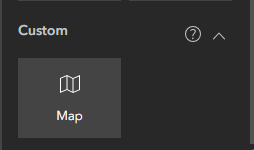
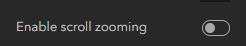

This custom widget allows you to create a **Map** widget that is only scrollable when you click on it. This is useful when, for example, you have an Experience Builder project where the user has to scroll through the page, but you don't want the **Map** widget to prevent him from scrolling (when the user hovers with the cursor over the **Map** widget, the scrolling happens inside the **Map** widget).
In order to get this to work you need to create a custom widget item. More information [here](https://doc.arcgis.com/en/experience-builder/11.0/configure-widgets/add-custom-widgets.htm). Only works for Enterprise >= 11.0.

The link to the manifest.json file is this one: https://alecsandrei.github.io/map-unscrollable/map-unscrollable/manifest.json.
Feel free to deploy the widget to your own server.

# Example

After creating the item, the widget will be available in the *Custom* tab

.

Disable scroll zooming for the custom **Map** widget.

Scrolling only is enabled when you click on the map. To disable scrolling, click outside the map.

